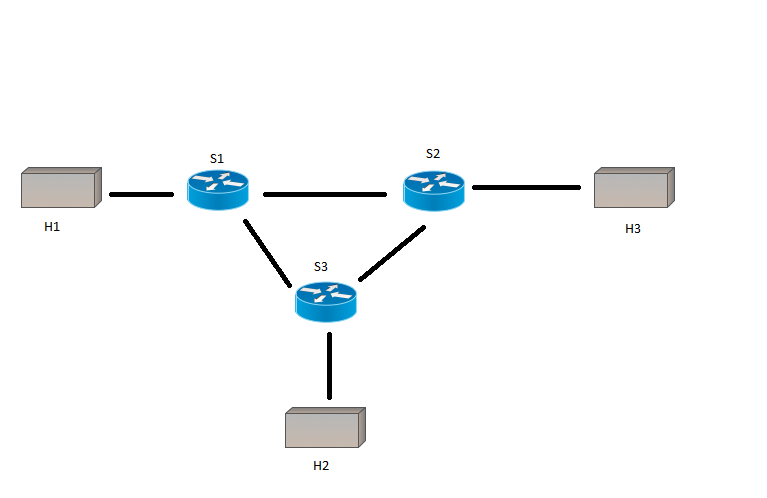
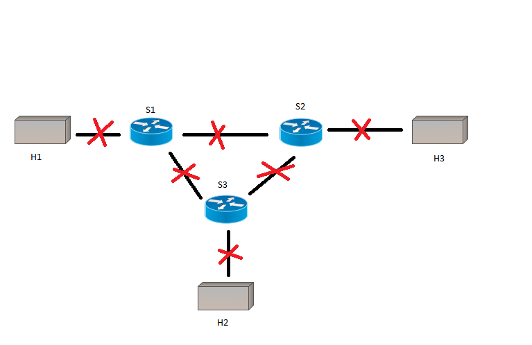

# ryu-config-switcher

## 1. Cel projektu

Implementacja rozwiązania, w którym konfiguracja sieci emulowanej w programie [mininet](http://mininet.org/) może być przełączana w wyniku interakcji aplikacji klienckiej (uruchamianej np. na smartfonie Android) i sterownika sieci SDN.

## 2. Architektura rozwiązania

Aplikacja RyuPilot na system operacyjny Android (napisana w języku Kotlin), kontroler [Ryu](https://osrg.github.io/ryu/) (Python) z mini serwerem HTTP (biblioteka [bottle.py](https://bottlepy.org/docs/dev/)) + mininet, oba pracujące na tej samej maszynie wirtualnej.

## 3. Założenia projektowe

Maksymalnym obrębem pracy pilota jest, dla ułatwienia, lokalna sieć WiFi. Kontroler pracuje na porcie `8888`, zaś serwer HTTP na porcie `8181`. Mobilna aplikacja kliencka ma możliwość ręcznego ustawienia adresu IP komputera/wirtualnej maszyny pod który będzie wysyłała zapytania. Aplikacja będzie dostępna do pobrania ze Sklepu Play w ramach [otwartego programu beta](https://play.google.com/apps/testing/studios.aestheticapps.ryupilot).

Podstawowym zapytaniem kierowanym do kontrolera SDN jest `POST` zawierający `setting_id` - identyfikator ustawienia sieci znanego wewnętrznie przez sterownik. Implementacja bardziej zaawansowanych zapytań nie będzie stanowiło problemu, jako że projekt jest niejako swoistym "Proof Of Concept".

## 4. Scenariusz interakcji

Użytkownik, będąc w obrębie sieci WiFi, w której jest również komputer z maszyną wirtualną z serwerem nasłuchującym żądań typu POST od klientów, ma możliwość przełączenia konfiguracji sieci emulowanej w programie mininet (z zestawu czterech predefiniowanych ustawień).

## 5. Konfiguracja

### Opis inicjalizacji komunikacji RyuPilot + kontroler:

*Uwaga!* Przed konfiguracją upewnij się, że masz zainstalowanego Pythona (wersja 2.7), kontroler Ryu, Mininet, bibliotekę bottle.py

1. Zainstaluj aplikację [RyuPilot](https://play.google.com/apps/testing/studios.aestheticapps.ryupilot).
2. Jeśli używasz VM, upewnij się, że działa ona w trybie bridge karty sieciowej (w programie VirtualBox: Ustawienia > Sieć > Karta sieciowa podłączona do: "mostkowana karta sieciowa (bridge)").
3. Jeśli używasz VM, znajdź interfejs karty sieciowej widziany przez Twój komputer.
4. Ustaw IP tego interfejsu w pliku `ip_data.txt`.
5. Ustaw to samo IP w swojej aplikacji RyuPilot.
6. Uruchom program serwer Bottle i Mininet z przykładową topologią komendą: `sudo python topo.py`
7. Sprawdź, czy terminal printuje przychodzące POST requesty.
8. Uruchom kontroler komendą: `ryu-manager --ofp-tcp-listen-port 8888 ryu_switch.py`
9. Sprawdź, czy program Mininet prawidłowo połączył się z zewnętrznym kontrolerem, jeśli tak - konfiguracja zakończona.

Wzorcowa odpowiedź serwera na wciśnięcie przycisku "Setting 1" w aplikacji RyuPilot:

```
Requested setting_id = 1
192.168.0.3 - - [11/Jan/2019 19:07:11] "POST /change_setting/ HTTP/1.1" 200 0
```

## 6. Przykładowa sieć i zmieniane ustawienia

### Sieć

<div align="center">
  
</div>

### setting_id=1 - całkowite włączenie sieci

<div align="center">
  
</div>

### setting_id=2 - odłączenie h2

<div align="center">
  
</div>

### setting_id=3 - odłączenie h1

<div align="center">
  
</div>

### setting_id=4 - całkowite wyłączenie sieci

<div align="center">
  
</div>

# Autorzy (squidsquad)

Michał Smutkiewicz, Paweł Gąska, Joanna Zalewska
